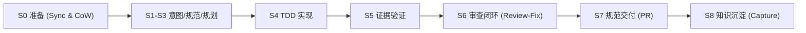

# Herdr 工程开发规范与强制红线 (RULES.md)

> 本文档为仓库开发的**最高约束准则**。所有在此仓库中工作的开发者与 AI Agent 必须无条件严格遵循。

---

## 1. 统一研发流程规范 (Unified Dev Flow: S0–S8)

本项目全面采用 **`/unified-dev-flow` 统一研发流程** 作为最高作业规范。所有在此仓库中工作的开发者与 AI Agent 必须无条件严格遵循以策略驱动（Policy-driven）的 S0–S8 全生命周期闭环，严禁跳步或无方案直接开工：

### 1.1 九大核心不变量 (Core Invariants)
1. **断点优先 (Resume before classification)**：接手任务前优先检查是否存在已有工作流或未完现场，杜绝盲目覆盖。
2. **读懂再写 (Read before committing)**：修改前必须彻底调研现有逻辑、依赖链路与影响面，严禁盲目开工。
3. **意图定基线 (Intent selects the base route)**：根据任务真实意图（Bug / Feature / Refactor / Migration / Docs 等）裁剪阶段，不走冗余弯路。
4. **复杂度定规划 (Complexity determines planning depth)**：轻量修改快速对齐，复杂重构深入设计，拒绝一刀切。
5. **风险度定质检 (Risk determines assurance depth)**：核心调度算法与状态机变更必须经过最高强度对抗测试与静态审查。
6. **单一控制权 (One controller owns execution)**：同一时刻仅由一个主控者推进执行，严禁嵌套死循环。
7. **改动即失效 (Any change invalidates stale evidence)**：源码或测试发生任何变动，既有验证与审查结论立即失效，必须重新跑测。
8. **无铁证不宣称完成 (No completion claim without fresh evidence)**：坚决抵制口头“已修复”，必须输出实时命令的 PASS 铁证。
9. **交付不越权 (Delivery never exceeds authorization)**：交付范围与分支目标严格受控，严禁越权修改主干。

### 1.2 关键阶段执行标准 (S0–S8)
- **S0 准备阶段 (Prepare - 强制一等公民)**：
  - **远端同步**：执行 `git fetch origin`，将最新代码同步至本地主仓库，严禁基于过期基线开工。
  - **CoW 沙盒建支**：严禁在主干工作区直接开发，严禁复用他人分支。必须使用 CoW (Copy-on-Write) 沙盒机制（`herdr-task launch` 或独立沙盒分支）隔离执行。
- **S1~S3 意图、规范与规划 (Intent, Spec & Plan)**：
  - 明确“为什么改”与“改动边界”，识别潜在风险与技术债；
  - 形成轻量或结构化 Plan 方案，必须等待关键约束对齐后方可进入编码。
- **S4 实现阶段 (Implement - TDD 先行)**：
  - 严格遵循测试驱动开发模式（RED ➔ GREEN ➔ REFACTOR）；
  - 编写最小优雅实现，坚决避免过度工程与 AI Slop。
- **S5 验证阶段 (Verify - 证据驱动)**：
  - 运行全量自动化测试套件（`pytest`），执行相关 CLI 检查；
  - 必须获取新鲜的真实执行结果，以命令输出作为唯一事实来源。
- **S6 审查阶段 (Review - 修复闭环)**：
  - 审查架构一致性（严格遵守 `herdr/` 纯核心与装配外壳解耦）；
  - 严查圈复杂度，坚决查杀无用样板类、过度防御判空与复读机注释；
  - 若审查发现问题，进入 **S6 ➔ S4 ➔ S5 ➔ S6** 修复闭环；连续 3 轮无法收敛强制升级人工介入。
- **S7 交付阶段 (Deliver - 规范收口)**：
  - 检查 Git 树纯净度，清理任何非受控临时文件；
  - 推送专属隔离分支，创建或更新标准化 PR。
- **S8 知识沉淀阶段 (Capture - 经验归档)**：
  - 检查本次是否排查了复杂 Bug、解决了同类复发问题或踩了技术坑；
  - 凡符合通用教训的，按四段式规范归档至 `docs/lessons/lessons-learned.md`；
  - 同步更新 LLM Wiki 主索引及演进日志 `wiki/log.md`。

---

## 2. 架构与工程强制红线 (System Taboos)

### 🔴 目录纯净红线
- **严禁向仓库根目录随意新增文件**：
  - 核心 Python 模块必须放入 `herdr/`
  - CLI 可执行脚本必须放入 `bin/`
  - 后台守护进程脚本必须放入 `services/`
  - 运维与安装脚本必须放入 `scripts/`
  - 文档必须按分类放入 `docs/` 对应子目录

### 🔴 空间隔离与 CoW 沙盒建支红线 (一等公民)
- **远端同步绝对前置**：任何任务执行前，必须首先从远端拉取最新代码（`git fetch origin`），并同步更新到本地主仓库（`main`），杜绝因基线漂移造成代码覆盖或隐式冲突。
- **CoW (Copy-on-Write) 沙盒建支为一等公民**：
  - 严禁在主干工作区或未经隔离的目录下直接修改代码执行业务 Task。
  - 严禁直接复用他人或历史遗留的未结功能分支。
  - 任何研发任务派发必须使用 `herdr-task launch`。
  - 所有 Agent 与开发者必须在独立的 CoW Clone（`~/.herdr-controller/clones/<task-id>`）或隔离沙盒中基于最新主干创建全新分支运行，确保任务现场物理与逻辑隔离、随时可销毁可回滚。

### 🔴 任务验收真伪红线
- **严禁使用普通 `git status` 替代基线验收**：
  - CoW 克隆会继承 Task 创建前已有的主干修改。
  - 必须使用 `herdr-task verify-baseline <task-id>` 作为任务文件变化的唯一事实来源。

### 🔴 拓扑动态自愈红线
- **严禁硬编码 Tab ID 或 Pane ID 作为业务标识**：
  - Tab ID / Pane ID 仅为易失的运行时缓存。
  - 业务逻辑事实仅取决于 Node ID / Label。
  - 调度前必须通过 `ensure_node_runtime` 或拓扑自愈引擎动态解析并按需自动重建。

### 🔴 守护进程运维红线
- **严禁使用 `kill -9` 粗暴终止 LaunchAgent**：
  - 热更新服务代码后，必须使用 `launchctl kickstart -k gui/$(id -u)/<label>` 优雅重启。
  - 严禁随意停止 `com.user.herdr-controller` 与 `com.user.herdr-sentinel`。

### 🔴 极简依赖原则 (Ponytail Principle)
- 能用 Python 标准库解决的，严禁引入第三方外部包。
- 拒绝为“未来可能的需求”预先编写过度灵活的泛化框架。

### 🔴 纯核心与装配解耦红线 (Functional Core, Imperative Shell)
- **业务决策纯函数化**：DAG 依赖解析、状态机流转判定、Agent 路由策略、自愈分支决策等核心算法，必须作为无副作用纯逻辑收敛在 `herdr/` 核心包中；严格保证输入标准数据结构（`dict` / `@dataclass`）、输出明确决策结果，无外部 I/O 与物理系统调用，具备零外部依赖、低成本的单元测试覆盖能力。
- **编排外壳与 I/O 隔离**：CLI 脚本 (`bin/`) 与常驻守护进程 (`services/`) 仅作为指令式装配外壳（Imperative Shell），职责收敛于组装执行管道、调度信号、处理 Launchctl/AppleScript/Git CoW/Subprocess 等物理副作用及本地 JSON 持久化，严禁在外壳中就地揉捏复杂业务决策。

### 🔴 模块内聚与反过度抽象红线 (Cohesion over Boilerplate)
- **坚决拒绝 Java 式过度分层**：严禁无意义地引入 DTO 转换类、DAO 抽象层或空壳 Service 类。持久化直接收敛在专职的数据存储/读写函数中，数据流转优先使用原生 `dict` 或轻量 `@dataclass`。
- **职责聚焦而非类碎片化**：通过高内聚模块与模块级纯函数组织逻辑，坚决抵制为了追求形式上的“单一职责”而派生大量只有数行代码、严重切碎调用链路的冗余包装类（AI Slop）。

### 🔴 文件健康度与梯度拆分红线 (File Size & Split Threshold)
- **拒绝机械硬限**：代码拆分以**业务内聚度与生命周期边界**为准绳，严禁死卡固定行数（如 300 行硬限）切碎原本高内聚的代码。
- **核心算法/业务模块 (`herdr/`)**：单文件健康区间为 **300 ~ 500 行**。超过 500 行且包含不同维度的业务决策时必须进行模块化拆解。
- **CLI 与守护进程装配层 (`bin/`, `services/`)**：允许维持在 **500 ~ 800 行**的紧凑单文件。超过 800 行时，必须首先检查并抽离其中混杂的决策算法、数据校验或子命令实现，下沉至 `herdr/`。

---

## 3. 安全要求 (Security Requirements)

1. **密钥与凭据隔离**：
   - 严禁将任何 API Key、Token、认证文件或敏感账号信息提交进 Git 仓库。
   - 仅从标准本地路径（如 `~/.claude.json`, `~/.codex/auth.json`）或系统环境变量中以只读方式读取凭据。
2. **探针无副作用安全**：
   - `preflight` 与 `deep-preflight` 探针在测试 Agent 连通性时，必须使用极简空指令（如 `echo READY`），严禁触发破坏性副作用或产生高额 Token 消耗。
3. **破坏性指令防御**：
   - 严禁在未经用户明确许可的情况下执行未受控的递归删除（如 `rm -rf` 通配符）或强制覆盖主干分支（`git push --force`）。
4. **并发与死锁防御**：
   - Agent 预占锁必须具备确定性的 TTL 超时机制，防止因单点异常崩溃导致全局任务永久死锁。
