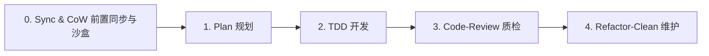

# Herdr 工程开发规范与强制红线 (RULES.md)

> 本文档为仓库开发的**最高约束准则**。所有在此仓库中工作的开发者与 AI Agent 必须无条件严格遵循。

---

## 1. Everything Claude Code 标准作业流程 (Standard Workflow)

开发任务必须严格按照以下阶段顺序闭环执行，严禁跳步或无方案直接开工：

### 1.0 启动前置：远端拉取与 CoW 沙盒建支（强制一等公民）
- **远端拉取与主库同步**：任何任务启动前，必须强制从远端仓库拉取最新代码（`git fetch origin` 并同步更新至本地主仓库），确保基线与远端 100% 保持一致，严禁基于本地过期或未同步的基线开工。
- **CoW 沙盒建立新分支**：严禁在主干仓库或已有的陈旧分支上直接开发。必须使用 CoW (Copy-on-Write) 沙盒隔离机制建立全新分支（如 `herdr-task launch` 或独立沙盒目录），确保每个任务处于完全干净、互不污染的物理与逻辑隔离环境。

### 1.1 规划阶段 (Plan)
- **明确目标与边界**：在修改任何代码前，必须彻底调研现有逻辑、依赖链路与影响面。
- **输出执行方案**：重大结构调整、依赖变更或核心算法变动，必须先沉淀技术方案并与用户/上下文对齐。
- **明确验收准则**：开工前必须确定具体的测试用例与验证命令。

### 1.2 开发阶段 (TDD - Test-Driven Development)
- **测试先行**：优先在 `tests/` 编写对应业务逻辑的失败测试用例。
- **最小化实现**：编写能够让测试通过的最简且优雅的代码，坚决避免过度工程。
- **本地实时反馈**：频繁运行 `pytest`，确保新逻辑可验证、老逻辑零回归。

### 1.3 质检阶段 (Code-Review)
- **架构一致性审查**：新代码是否符合项目目录规范（`herdr/`、`services/`、`bin/`）与分层设计。
- **消灭 AI Slop (AI 废话与无用样板)**：坚决删除防御性过度的无用判空、冗余包装类与复读机式注释。
- **圈复杂度与边界防护**：检查循环嵌套、超时控制、异常捕获粒度与类型安全性。

### 1.4 维护阶段 (Refactor-Clean)
- **代码重构与坏味道清理**：合并重复模式，精简接口，清理未使用的变量与废弃导入。
- **文档同步更新**：代码路径或命令变更后，必须即时同步 `README.md`、`docs/`、`CLAUDE.md` 及 `AGENTS.md`。
- **环境与文件零污染**：严禁残留 `.tmp`、`.bak`、临时脚本或未在 `.gitignore` 声明的缓存文件。

---

## 2. 架构与工程强制红线 (System Taboos)

### 🔴 目录纯净红线
- **严禁向仓库根目录随意新增文件**：
  - 核心 Python 模块必须放入 `herdr/`
  - CLI 可执行脚本必须放入 `bin/`
  - 后台守护进程脚本必须放入 `services/`
  - 运维与安装脚本必须放入 `scripts/`
  - 文档必须按分类放入 `docs/` 对应子目录

### 🔴 空间隔离与 CoW 沙盒建支红线 (一等公民)
- **远端同步绝对前置**：任何任务执行前，必须首先从远端拉取最新代码（`git fetch origin`），并同步更新到本地主仓库（`main`），杜绝因基线漂移造成代码覆盖或隐式冲突。
- **CoW (Copy-on-Write) 沙盒建支为一等公民**：
  - 严禁在主干工作区或未经隔离的目录下直接修改代码执行业务 Task。
  - 严禁直接复用他人或历史遗留的未结功能分支。
  - 任何研发任务派发必须使用 `herdr-task launch`。
  - 所有 Agent 与开发者必须在独立的 CoW Clone（`~/.herdr-controller/clones/<task-id>`）或隔离沙盒中基于最新主干创建全新分支运行，确保任务现场物理与逻辑隔离、随时可销毁可回滚。

### 🔴 任务验收真伪红线
- **严禁使用普通 `git status` 替代基线验收**：
  - CoW 克隆会继承 Task 创建前已有的主干修改。
  - 必须使用 `herdr-task verify-baseline <task-id>` 作为任务文件变化的唯一事实来源。

### 🔴 拓扑动态自愈红线
- **严禁硬编码 Tab ID 或 Pane ID 作为业务标识**：
  - Tab ID / Pane ID 仅为易失的运行时缓存。
  - 业务逻辑事实仅取决于 Node ID / Label。
  - 调度前必须通过 `ensure_node_runtime` 或拓扑自愈引擎动态解析并按需自动重建。

### 🔴 守护进程运维红线
- **严禁使用 `kill -9` 粗暴终止 LaunchAgent**：
  - 热更新服务代码后，必须使用 `launchctl kickstart -k gui/$(id -u)/<label>` 优雅重启。
  - 严禁随意停止 `com.user.herdr-controller` 与 `com.user.herdr-sentinel`。

### 🔴 极简依赖原则 (Ponytail Principle)
- 能用 Python 标准库解决的，严禁引入第三方外部包。
- 拒绝为“未来可能的需求”预先编写过度灵活的泛化框架。

### 🔴 纯核心与装配解耦红线 (Functional Core, Imperative Shell)
- **业务决策纯函数化**：DAG 依赖解析、状态机流转判定、Agent 路由策略、自愈分支决策等核心算法，必须作为无副作用纯逻辑收敛在 `herdr/` 核心包中；严格保证输入标准数据结构（`dict` / `@dataclass`）、输出明确决策结果，无外部 I/O 与物理系统调用，具备零外部依赖、低成本的单元测试覆盖能力。
- **编排外壳与 I/O 隔离**：CLI 脚本 (`bin/`) 与常驻守护进程 (`services/`) 仅作为指令式装配外壳（Imperative Shell），职责收敛于组装执行管道、调度信号、处理 Launchctl/AppleScript/Git CoW/Subprocess 等物理副作用及本地 JSON 持久化，严禁在外壳中就地揉捏复杂业务决策。

### 🔴 模块内聚与反过度抽象红线 (Cohesion over Boilerplate)
- **坚决拒绝 Java 式过度分层**：严禁无意义地引入 DTO 转换类、DAO 抽象层或空壳 Service 类。持久化直接收敛在专职的数据存储/读写函数中，数据流转优先使用原生 `dict` 或轻量 `@dataclass`。
- **职责聚焦而非类碎片化**：通过高内聚模块与模块级纯函数组织逻辑，坚决抵制为了追求形式上的“单一职责”而派生大量只有数行代码、严重切碎调用链路的冗余包装类（AI Slop）。

### 🔴 文件健康度与梯度拆分红线 (File Size & Split Threshold)
- **拒绝机械硬限**：代码拆分以**业务内聚度与生命周期边界**为准绳，严禁死卡固定行数（如 300 行硬限）切碎原本高内聚的代码。
- **核心算法/业务模块 (`herdr/`)**：单文件健康区间为 **300 ~ 500 行**。超过 500 行且包含不同维度的业务决策时必须进行模块化拆解。
- **CLI 与守护进程装配层 (`bin/`, `services/`)**：允许维持在 **500 ~ 800 行**的紧凑单文件。超过 800 行时，必须首先检查并抽离其中混杂的决策算法、数据校验或子命令实现，下沉至 `herdr/`。

---

## 3. 安全要求 (Security Requirements)

1. **密钥与凭据隔离**：
   - 严禁将任何 API Key、Token、认证文件或敏感账号信息提交进 Git 仓库。
   - 仅从标准本地路径（如 `~/.claude.json`, `~/.codex/auth.json`）或系统环境变量中以只读方式读取凭据。
2. **探针无副作用安全**：
   - `preflight` 与 `deep-preflight` 探针在测试 Agent 连通性时，必须使用极简空指令（如 `echo READY`），严禁触发破坏性副作用或产生高额 Token 消耗。
3. **破坏性指令防御**：
   - 严禁在未经用户明确许可的情况下执行未受控的递归删除（如 `rm -rf` 通配符）或强制覆盖主干分支（`git push --force`）。
4. **并发与死锁防御**：
   - Agent 预占锁必须具备确定性的 TTL 超时机制，防止因单点异常崩溃导致全局任务永久死锁。
