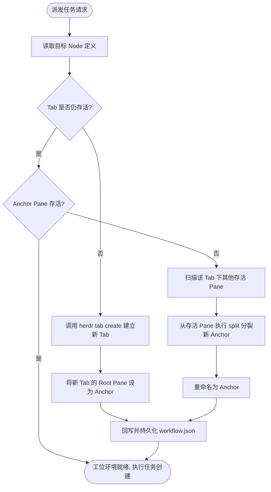

# Tab = Workflow Node 架构模型与现场机制

> 本文档详细阐述 Herdr “Tab 作为工作流节点、Pane 作为 Agent 工位、Agent 作为执行者”的设计哲学、Anchor Pane 锚点机制与动态现场自愈原理。

---

## 1. 设计哲学演进

过去版本将软件开发写死为固定 6 阶段：
`requirements` ➔ `plan` ➔ `implementation` ➔ `test` ➔ `review` ➔ `wrapup`。

这种硬编码模式存在两个根本缺陷：
1. **领域受限**：无法用于标书制作、合同审批、客户投诉处理、数据分析等非研发类流程。
2. **脆弱的运行时绑定**：系统强依赖初始化时生成的 `w9:t2` / `w9:pN`，一旦用户误关 Tab 或清理 Pane，后续任务调度直接由于 `pane_not_found` 崩溃。

### 核心革新：Tab = Workflow Node
- **Tab 语义化**：Tab 不再代表固定的“开发步骤”，而是通用的**工作流拓扑节点 (Workflow Node)**。
- **按需生成**：选择什么模板，就自动生成多少个 Tab；包含几层分支，就呈现几组工位。
- **解耦核心原则**：
  > **Workflow Definition 是逻辑事实，Tab ID / Pane ID 是动态运行时映射。**

---

## 2. 空间模型与现场层次

```text
Workspace (项目空间)
  │
  ├── Tab 1: Coordinator (流程大脑 / 调度现场)
  │     └── Pane 1: Coordinator Agent (系统协调员)
  │
  ├── Tab 2: Node 1 (工作流节点现场)
  │     ├── Pane Anchor: 只读母体锚点 (保持 Tab 存活与分裂工位)
  │     ├── Pane Task-A: Agent 工位 1 (现场执行)
  │     └── Pane Task-B: Agent 工位 2 (并发执行)
  │
  └── Tab N: Node N (其他工作流节点现场)
        ├── Pane Anchor: 只读母体锚点
        └── Pane Task-X: Agent 工位
```

---

## 3. Anchor Pane (母体锚点) 机制

### 3.1 为什么必须有 Anchor Pane？
在 Herdr 底层设计中：
- 创建新 Tab 时会附带一个初始 Root Pane。
- 在已有 Tab 中新增工位，依赖 `herdr pane split <parent_pane>` 指令，必须指定一个既有的父 Pane。
- 如果一个 Tab 中的任务 Pane 在执行完成后被用户全部关闭，且没有固定的底座，该 Tab 将无法再通过常规方式分裂新的工位。

因此，Herdr 为每个 Node Tab 建立一个只读的 **Anchor Pane**：
1. 名称固定为 `"Anchor"`；
2. 不承载具体的 Agent 任务执行，保持干净；
3. 作为后续该 Node 派发所有 Task 时的 Split 母体。

---

## 4. 运行时自愈流程 (`ensure_node_runtime`)

每次任务启动前，系统执行严格自愈保障：



通过这一闭环，无论用户在 Herdr 终端中如何关闭窗格或切换标签，工作流引擎均能自适应恢复，保证生产级鲁棒性。
