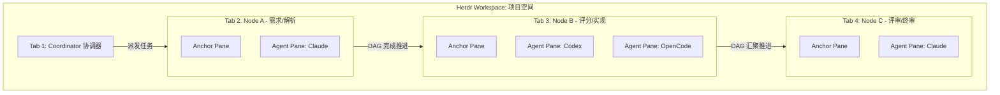
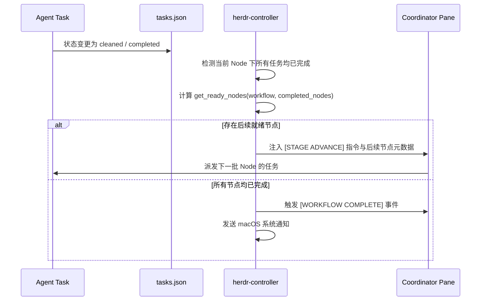

# HAFlow 通用 Agent 编排系统使用指南 (Tab = Workflow Node)

> **公司：上海共事智能科技有限公司**  
> **品牌：共事**  
> **产品：HAFlow**  
> **一句话：让人和多个 AI Agent 一起把事情做完**  
> *Human + Agent, in Flow*  
> 本文档详细介绍 HAFlow “Tab 作为工作流节点、Pane 作为 Agent 工位、Agent 作为执行者”的通用多 Agent 编排系统的使用方法、模板开发与运维自愈机制。

---

## 目录
1. [核心概念与模型映射](#1-核心概念与模型映射)
2. [快速开始：从模板启动工作流](#2-快速开始从模板启动工作流)
3. [内置工作流模板介绍](#3-内置工作流模板介绍)
4. [任务派发与节点状态查看](#4-任务派发与节点状态查看)
5. [运行时自愈机制 (Runtime Self-Healing)](#5-运行时自愈机制-runtime-self-healing)
6. [如何自定义新的 Workflow 模板](#6-如何自定义新的-workflow-模板)
7. [Node 级 Agent 路由策略配置](#7-node-级-agent-路由策略配置)
8. [DAG 依赖与自动推进机制](#8-dag-依赖与自动推进机制)
9. [常用 CLI 命令速查表](#9-常用-cli-命令速查表)
10. [常见问题与故障排查 (FAQ)](#10-常见问题与故障排查-faq)

---

## 1. 核心概念与模型映射

HAFlow 通用编排系统打破了过去“固定 6 阶段软件开发”的硬编码限制，将业务领域（研发、标书、客服、法务、内容等）全面抽象为通用的 **DAG 工作流模型**：

```text
Project (项目 / 业务空间)
  └── Workflow (工作流实例)
        └── Node (工作流节点，有依赖关系的 DAG 拓扑)
              └── Task (具体执行工单)
                    └── Agent (执行工单的 AI 或程序)
```

在终端工作区现场中，这套模型与界面元素形成严格的一对一映射：

| 现场元素 | 编排模型概念 | 说明 |
| :--- | :--- | :--- |
| **Workspace** | **Project / 项目空间** | 每个被托管的项目在终端多工位底座中对应独立的 Workspace（如 `w9`）。 |
| **Tab** | **Workflow Node (节点)** | 每个节点对应一个独立的 Tab，名称带有节点序号与业务标签。 |
| **Pane** | **Agent 工位 / 任务现场** | 每个 Tab 维护一个只读 Anchor Pane 作为锚点，Task 运行时自动 Split 独立工作工位。 |
| **Agent** | **Executor (执行者)** | Claude Code, OpenCode, Codex, QoderCLI, Agy, Pi 等多样化模型。 |
| **Task** | **Work Unit (工作单)** | 带有明确目标 (goal)、验收标准 (acceptance criteria) 的执行单元。 |



---

## 2. 快速开始：从模板启动工作流

系统提供一键式启动命令 `herdr-factory run`，通过 `--template` 指定工作流模板。

### 步骤 1：查看所有可用的工作流模板
```bash
herdr-factory templates
```
**输出示例：**
```text
Available Workflow Templates
========================================================================
bidding                    [1.0] 标书生成与评审流程 (7 nodes)
  面向招投标标书制作的多 Agent 协同流程 (招标文件解析 -> 评分项提取 & 历史项目检索 -> 投标策略 -> 标书生成 -> 合规检查 -> 最终审阅)
customer-service           [1.0] 客户投诉响应与处理流程 (7 nodes)
  面向客户客诉的自动化与人机协同工作流 (客户投诉 -> 情绪判断 -> 原因分析 -> 话术生成 -> 人工审批 -> TTS -> 发送)
software-development-v1    [1.0] 软件开发标准流程 (6 nodes)
  标准的 6 阶段软件开发与评审流程 (需求分析 -> 计划 -> 实现 -> 测试 -> 评审 -> 收尾)
========================================================================
```

### 步骤 2：启动特定模板的工作流

#### 示例 A：启动标准软件开发工作流
```bash
herdr-factory run "实现用户登录认证功能与密码重置" --template software-development-v1
```

#### 示例 B：启动标书生成工作流
```bash
herdr-factory run "针对智慧交通项目招标文件的投标文件制作" --template bidding
```

#### 示例 C：启动客户投诉响应流程
```bash
herdr-factory run "处理客户关于退款延迟的严重投诉" --template customer-service
```

### 步骤 3：系统自动执行的初始化行为
1. **识别/初始化 Workspace**：为目标项目挂载独立的 Herdr 工作空间。
2. **Tab 动态创建**：按照模板定义的 Node 列表，依次自动创建对应 Tab（如标书流程自动创建 7 个 Tab）。
3. **Anchor 锚点建立**：在每个 Tab 内部自动生成并锁定一个 `Anchor` Pane，作为后续动态派生 Agent 工位的母体。
4. **Agent Deep Preflight**：自动对本地已安装的 Agent（Claude, Codex, OpenCode, Qoder 等）进行深层沙盒试跑探测，记录当前健康的 Agent 候选集。
5. **通知 Coordinator**：在 `wX:p1` (Coordinator Pane) 注入带有完整上下文、当前就绪 Node 和执行规范的初始 Prompt。

---

## 3. 内置工作流模板介绍

### 3.1 软件开发标准流程 (`software-development-v1`)
面向标准化软件工程研发，具备完整的 CoW 隔离、测试与合并评审流程。
- **节点拓扑**：
  `requirements` (需求分析) ➔ `plan` (方案设计) ➔ `implementation` (实现/并行) ➔ `test` (测试) ➔ `review` (评审) ➔ `wrapup` (收尾合并)
- **特点**：
  - 支持 `implementation` 节点多任务并发执行。
  - `review` 与 `test` 节点自动在候选分支 (Candidate Branch) 执行，不污染 `main`。
  - 完全向下兼容既有的研发流程脚本与命令。

### 3.2 标书生成与评审流程 (`bidding`)
面向复杂投标文件制作的多 Agent 协同流程，展示了 DAG 的**分支并行与汇聚**能力。
```text
招标文件解析 (tender_parse)
      ├──> 评分项提取 (scoring_extract) ──┐
      └──> 历史项目检索 (history_search) ──┴──> 投标策略 (strategy)
                                                  │
                                                  ▼
                                            标书生成 (document_generation)
                                                  │
                                                  ▼
                                            合规检查 (compliance)
                                                  │
                                                  ▼
                                            最终审阅 (final_review)
```
- **特点**：
  - `scoring_extract` 与 `history_search` 在招标文件解析完成后**同时并发启动**。
  - `strategy` 节点同时声明依赖两个前置节点，只有双方均完成时才会汇聚触发。
  - `final_review` 节点固定要求 `claude` 执行终审。

### 3.3 客户投诉响应流程 (`customer-service`)
面向客服与工单处理流程，展示了**多节点类型 (Agent / Human / Tool)** 的协同。
- **节点拓扑**：
  `complaint_intake` (客诉录入) ➔ `sentiment_analysis` (情绪判断) ➔ `root_cause` (原因分析) ➔ `response_draft` (话术生成) ➔ `human_approval` (人工审批) ➔ `tts_generation` (TTS 转换) ➔ `dispatch` (发送触达)
- **特点**：
  - 包含 `human_approval` 人工审批拦截节点（`node_type: human`）。
  - 包含 `tts_generation` 工具程序节点（`node_type: tool`）。

---

## 4. 任务派发与节点状态查看

### 4.1 派发任务到特定 Node (`herdr-task launch`)
创建任务时，使用 `--node` 参数指定目标节点（原 `--stage` 参数完全兼容）：

```bash
herdr-task launch \
  --workflow-id wf-myproject-20260912-160000 \
  --node requirements \
  --task-type explore \
  --agent auto \
  --goal "全面分析招标文件中的所有硬性废标条款" \
  --criteria "输出废标条款清单到 docs/bidding/compliance_matrix.md"
```

> **系统自愈保障**：派发前系统会自动调用 `ensure_node_runtime`，若该 Node 的 Tab 或 Anchor Pane 不慎被关闭，系统会在任务派发前自动检测并修复重建，避免报 `pane_not_found` 错误。

### 4.2 查看当前 Workflow 各 Node 推进状态

#### 方式 1：使用 `herdr-factory status`（概要展示）
```bash
herdr-factory status wf-myproject-20260912-160000
```
**输出示例：**
```text
Project: xiyu-bid-poc (/Users/user/workspace/xiyu-bid-poc)
Workflow: wf-xiyu-bid-poc-20260912-160000
========================================================================================
requirements (需求分析)      t-req-001=cleaned
plan (方案设计)              t-plan-001=cleaned
implementation (实现)        t-impl-001=completed, t-impl-002=working
test (测试)                  -
review (评审)                -
wrapup (收尾)                -
========================================================================================
```

#### 方式 2：使用 `herdr-task node-status`（JSON 详细数据）
```bash
herdr-task node-status --workflow-id wf-myproject-20260912-160000
```
可获得包含每个 Node 的 `depends_on` 状态、对应 `tab_id`、`anchor_pane_id`、关联的任务状态详情。

---

## 5. 运行时自愈机制 (Runtime Self-Healing)

过去系统中最大的稳定性痛点是：**系统将运行时的 Tab ID / Pane ID 当成了不可变事实**。如果用户或系统意外关闭了某个 Tab 或 Pane，后续任务派发就会发生找不到目标的严重崩溃。

新架构建立了核心原则：
> **Workflow Definition 是逻辑事实，Tab ID / Pane ID 只是动态运行时映射。**

### 5.1 自愈工作原理 (`ensure_node_runtime`)
每次派发任务前，系统都会调用 `ensure_node_runtime(workflow_id, node_id)`：
1. **检查 Tab 存活性**：通过 `herdr tab get <tab_id>` 探测。如果 Tab 已被关闭，系统自动为该节点创建新 Tab，并将 Root Pane 设为 Anchor Pane。
2. **检查 Anchor Pane 存活性**：通过 `herdr pane get <anchor_id>` 探测。如果 Anchor Pane 已死：
   - 自动扫描该 Tab 下当前仍存活的其他 Pane；
   - 通过 `herdr pane split <alive_pane>` 切割出一个崭新的 Anchor Pane；
   - 将其重命名为 `"Anchor"`；
   - 将新的 `anchor_pane_id` 自动回写并持久化到 `workflow.json`；
   - 平滑继续执行任务创建。

### 5.2 手动触发自愈检测
如需手动检查并修复某个节点的工作环境，可执行：
```bash
herdr-task ensure-runtime --workflow-id <workflow_id> --node <node_id>
```
**输出示例：**
```json
{
  "node_id": "requirements",
  "label": "需求分析",
  "tab_id": "w9:t2",
  "anchor_pane_id": "w9:pQ",
  "status": "ready"
}
```

---

## 6. 如何自定义新的 Workflow 模板

你可以为任何业务场景定义自己的 Workflow 模板。

### 6.1 模板存放位置（二选一）
1. **项目或内置目录**：`/Users/user/herdr/workflow_templates/<template_name>.yaml`
2. **个人用户目录**：`~/.herdr-controller/templates/<template_name>.yaml`

系统会自动扫描并识别这两个目录下的 `.yaml`, `.yml`, `.json` 文件。

### 6.2 模板编写规范与完整示例

新建文件 `~/.herdr-controller/templates/market-research.yaml`：

```yaml
name: market-research
label: 市场调研与竞品分析工作流
version: "1.0"
description: 自动化竞品信息采集、功能对标与市场分析报告生成

nodes:
  - id: competitor_data_collection
    label: 竞品信息采集
    node_type: agent
    purpose: 抓取并汇总目标竞品的产品特性、定价模型与用户反馈
    default_task_type: explore
    default_integration_mode: none
    agent_policy:
      preferred:
        - opencode
        - codex
    required_outputs:
      - docs/research/raw_competitor_data.json

  - id: feature_benchmark
    label: 功能矩阵对标
    node_type: agent
    depends_on:
      - competitor_data_collection
    purpose: 提炼竞品核心功能对标矩阵与优劣势雷达
    default_task_type: docs
    agent_policy:
      preferred:
        - claude

  - id: pricing_analysis
    label: 定价策略分析
    node_type: agent
    depends_on:
      - competitor_data_collection
    purpose: 分析市场价格带与商业模式
    default_task_type: docs
    parallel: true

  - id: executive_summary
    label: 战略分析报告汇编
    node_type: agent
    depends_on:
      - feature_benchmark
      - pricing_analysis
    purpose: 汇总矩阵与定价分析，输出管理层决策简报
    agent_policy:
      fixed: claude
    required_outputs:
      - docs/research/EXECUTIVE_REPORT.md
```

### 6.3 验证与启动自定义模板
保存文件后，立即可以在列表看到：
```bash
herdr-factory templates
```
然后启动它：
```bash
herdr-factory run "调研国内主流低代码平台竞争格局" --template market-research
```

### 6.4 在共事工厂控制台页面编排（免手写 YAML 入口）
上述 YAML 亦可通过控制台页面完成：打开 `http://127.0.0.1:8765/` → 动作区 **模板库**，即可查看内置/自定义模板、预览节点依赖（DAG）、新建或编辑模板。保存时服务端自动执行与 CLI 相同的 DAG 校验（未知依赖 / 循环依赖会被拒绝）。“新建需求”弹窗可选“工作流模板”，启动时透传 `--template`。内置模板只读；自定义模板保存至 `~/.herdr-controller/templates/`，仅影响之后新启动的 Workflow。

---

## 7. Node 级 Agent 路由策略配置

在 Node 的 `agent_policy` 字典中，你可以精确控制该节点的执行者画像：

```yaml
agent_policy:
  # 1. 强制固定某 Agent（跳过自动路由）
  fixed: claude

  # 2. 偏好优先级列表（路由时按顺序优先选择）
  preferred:
    - opencode
    - codex
    - qodercli

  # 3. 坚决排除的 Agent
  exclude:
    - pi

  # 4. 最大/最小并发 Agent 数量限制
  min_agents: 1
  max_agents: 3
```

### 调度优先级原则
当一个 Task 被派发时，Agent Router 的决策顺位为：
1. **用户运行时强制覆盖**：`herdr-task launch --agent <name>` 或 Workflow 级 `agent_override`。
2. **Node 级固定策略**：`node.agent_policy.fixed`。
3. **Node 级偏好策略**：从当前 Workflow 通过 Deep Preflight 验证健康的 `healthy_agents` 中，按 `node.agent_policy.preferred` 优先挑选负载最低的工位。
4. **项目级阶段/任务类型默认偏好**。

---

## 8. DAG 依赖与自动推进机制

Controller 守护进程采用事件驱动模式运行：



### 关键规则：
1. **DAG 校验保护**：模板加载时会执行 Kahn 算法检验。若存在环（循环依赖）或依赖了未声明的节点，系统会在启动时拒绝执行并报错。
2. **分支并行与阻塞汇聚**：
   - 只要某个 Node 的所有 `depends_on` 节点都已进入完成集合，该 Node 立即变为 `ready`。
   - 汇聚节点（如 `strategy` 依赖 `scoring_extract` 和 `history_search`）会一直等待，直到所有依赖分支全部完成。

---

## 9. 常用 CLI 命令速查表

| 操作需求 | 命令 |
| :--- | :--- |
| **列出可用模板** | `herdr-factory templates` |
| **启动指定模板的工作流** | `herdr-factory run "<需求内容>" --template <template_name>` |
| **启动并指定特定项目目录** | `herdr-factory run "<需求内容>" --project /path/to/project --template <name>` |
| **启动并强制指定执行 Agent** | `herdr-factory run "<需求内容>" --agent codex` |
| **查看工作流推进状态** | `herdr-factory status <workflow_id>` |
| **查看节点依赖与工位详情** | `herdr-task node-status --workflow-id <workflow_id>` |
| **手动修复节点工位运行时** | `herdr-task ensure-runtime --workflow-id <workflow_id> --node <node_id>` |
| **向指定节点创建并启动任务** | `herdr-task launch --workflow-id <id> --node <node> --goal "<目标>" --criteria "<标准>"` |
| **运行自动化测试套件** | `pytest -v tests/test_workflow_engine.py` |
| **重启 Controller 后台服务** | `launchctl kickstart -k gui/$(id -u)/com.user.herdr-controller` |

---

## 10. 常见问题与故障排查 (FAQ)

### Q1：如果不小心在 Herdr 界面里把某个节点的 Tab 或 Anchor Pane 关闭了怎么办？
**完全不需要担心。**
系统已经实现自动自愈。当你通过 `herdr-task launch` 或 Controller 自动调度向该节点派发新任务时，系统会自动探测并瞬间完成 Tab 或 Anchor Pane 的重建，继续平滑派发任务。

### Q2：如何知道当前哪些 Agent 可用？
运行以下命令检查环境中的 Agent：
```bash
herdr-factory doctor
```
或直接查看最近一次 Deep Preflight 探针日志：
```bash
herdr-deep-preflight --deep
```

### Q3：现有的旧项目（如 `xiyu-bid-poc`、`nexusarchive`）还能正常工作吗？
**兼容支持。**
系统内部的 `normalize_workflow` 会在加载时统一生成 `nodes` 与 `stages` 的兼容表示。现有的 `--stage` 参数、旧版脚本以及已派发的历史任务继续获得支持，降低迁移成本。
