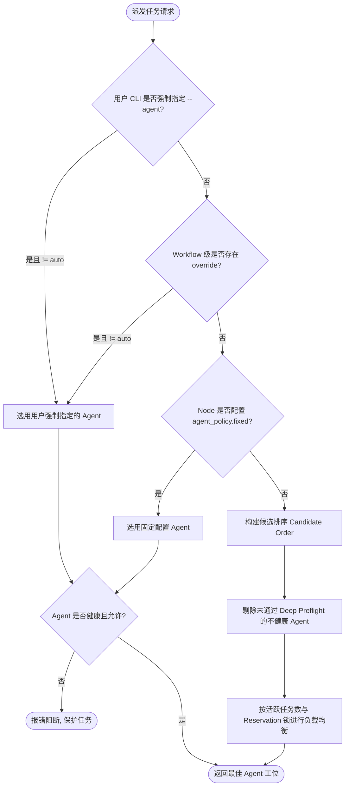

# Agent 路由与策略规范 (Agent Policy & Routing Spec)

> **公司：上海共事智能科技有限公司**  
> **品牌：共事**  
> **产品：HAFlow**  
> **一句话：让人和多个 AI Agent 一起把事情做完**  
> *Human + Agent, in Flow*  
> 本文档规范定义 HAFlow 系统中 Agent 的选择、健康准入、Node 策略继承与并发预占 (Reservation) 机制。

---

## 1. 概念与角色

HAFlow 支持多种不同特性的执行 Agent：
- `claude` (Claude Code)：逻辑推理强，适合架构、评审与全局把关；
- `codex` (Codex CLI)：代码能力强，适合实现与精细重构；
- `opencode` (OpenCode Interpreter)：执行与终端互动强，通用性高；
- `qodercli` (Qoder)：执行速度快，适合脚本与常规编码；
- `agy` (Antigravity)：深层分析与自动化工具链；
- `pi` (Pi Agent)：轻量型辅助或探索。

---

## 2. 调度决策流水线

当派发任务时，`herdr_agent_router.py` 的 `choose_agent` 函数按照如下 5 步严格决策：

---

## 3. 并发控制与预占锁 (Reservation)

为了避免多任务瞬间同时派发导致所有 Task 争抢同一个 Agent，系统在 `~/.herdr-controller/router-reservations.json` 中实现了带租期 (TTL) 的预占锁机制：
- 当 Router 选中某 Agent 时，自动为该任务登记带时间戳的预占记录；
- 在后续任务路由计算负载时，将活跃任务数 + 预占任务数合并计算；
- 任务正式启动或超时释放时自动解除预占。
