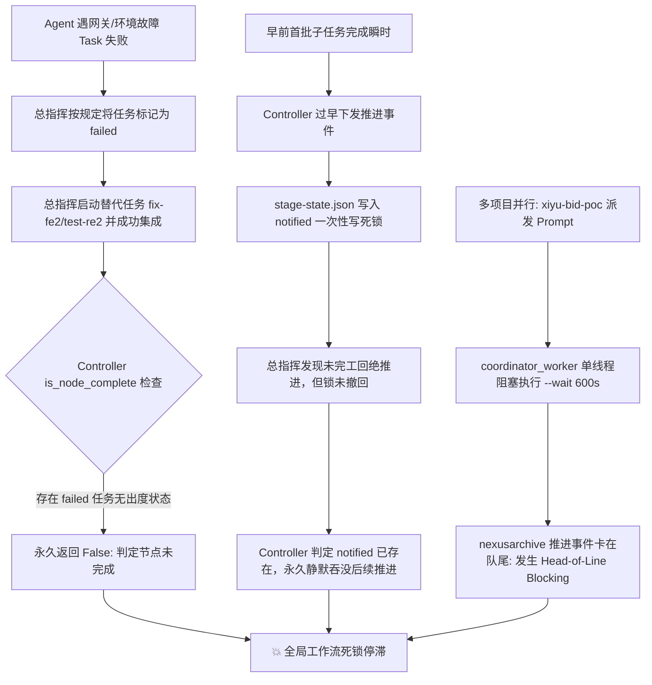

# 彻底解决工作流推进死锁与复发防范的工程化设计方案

## 1. 深度根因复盘 (Root Cause Deep-Dive)

通过对系统运行日志、任务状态库（`tasks.json`）、阶段防重锁（`stage-state.json`）以及系统进程快照的深度排查，导致工作流推进死锁且频繁复发的根因并非偶然的 Prompt 理解偏差，而是系统架构中存在的**四大工程性结构缺陷**：



### 缺陷 1：任务生命周期严苛且缺少“替代/作废 (Superseded)”语义
- `bin/herdr-task:TRANSITIONS` 中 `"failed": set()`，为不可逆终态。
- `is_node_complete` 实行一票否决：`all(t.get("status") in ("completed", ...) for t in tasks)`。
- 一旦某节点曾有任务失败，即便后续被新任务完全承接且验证通过，历史失败也会像“幽灵毒药”一样永久杀死当前节点的完成判定。

### 缺陷 2：阶段推进缓存 `stage-state.json` 是单向“一次性死锁”
- Controller 在首批任务刚完成的瞬时容易过早下发推进并记录 `"notified"`。
- 当总指挥发现需要修复或补测而拒绝推进时，`stage-state.json` 的 `"notified"` 状态**从未被反向撤销**。
- 防重规则 `if state.get(key) in ("queued", "notified"): return False` 导致后续真正的完工事件被永久静默丢弃。

### 缺陷 3：全局协调器单线程处理导致队头阻塞 (Head-of-Line Blocking)
- `services/herdr-controller.py` 使用**单一全局线程**处理所有工作流的 `coordinator_queue`。
- 处理时直接执行同步阻塞的子进程：`subprocess.run(["herdr", "agent", "prompt", coord_pane, message, "--wait", "--timeout", "600000"])`。
- **现场实锤**：当前系统中 `w9:p1`（标书项目）正在执行 prompt 并占住进程（自 17:57 起持续等待中），导致 `wA`（nexusarchive）即使已经触发推进，也死死卡在队头之后无法发出！

### 缺陷 4：协议职责错位
- Controller 给总指挥的 Prompt 强制要求：“`节点推进，继续交给 Controller`”，总指挥照做后挂起。
- Controller 代码层面缺乏对“任务已被替代”或“总指挥挂起”的主动探活与自愈机制。

---

## 2. 彻底防复发的工程化架构方案 (Target Architecture)

为了从根本上杜绝该问题复发，需从**数据模型、DAG判定、缓存自愈、并发派发、运维工具**五个维度进行重塑：

### 维度一：任务状态机拓展与替代协议 (Task Lifecycle & Supersede Protocol)
1. **状态机升级 (`TRANSITIONS`)**:
   - 增加第一公民状态 `superseded`（已作废/被替代）。
   - 允许从 `failed`、`rework`、`dispatched`、`working` 迁移至 `superseded`。
   - 允许从 `cleaned` 迁移至 `completed`（支持误清理或补救验证）。
2. **CLI 支持替代指令 (`herdr-task`)**:
   - 新增 `herdr-task supersede <old_task_id> [--by <new_task_id>] [--reason <text>]`。
   - 在 `herdr-task launch` 中增加 `--supersedes <old_task_id>` 参数：在派发重试/替代任务时，原子化将原任务标记为 `superseded`，记录关联并释放资源。

### 维度二：DAG 节点完成判定重构 (DAG Completion Re-evaluation)
- 重构 [`services/herdr-controller.py:is_node_complete`](file:///Users/user/HAFlow/services/herdr-controller.py#L272) 与 [`bin/herdr-task:node_status`](file:///Users/user/HAFlow/bin/herdr-task#L1350)：
  ```python
  # 排除已被替代的任务
  active_tasks = [
      t for t in tasks 
      if t.get("status") != "superseded" and not t.get("superseded_by")
  ]
  if not active_tasks:
      return False
  return all(
      t.get("status") in ("completed", "committed", "integrated", "cleanup_ready", "cleaned")
      for t in active_tasks
  )
  ```
- 只要节点内存在有效的替代任务且全部完成，历史 `superseded` 任务不再阻断 DAG 推进！

### 维度三：阶段推进缓存自愈与自动失效 (Dynamic Invalidation of `stage-state.json`)
在 Controller 每次调度循环中建立双向校验：
1. **前置未就绪时反向撤销锁 (Auto-Revocation)**:
   若节点 `M` 记录为 `notified` 或 `queued`，但其任何一个前置依赖节点重新变为“未完成”（例如因测试失败新增了修复任务），Controller **自动清除** `workflow_id:M` 的防重锁，确保后续修复完成后能重新触发通知。
2. **目标节点空载保护 (Stale Advance Recovery)**:
   若节点 `M` 处于 `notified`，但该阶段在 `tasks.json` 中任务数为 0（即总指挥未开始派发任何任务），且总指挥已处于 `idle` 状态超过一定阈值（如 60 秒），自动清除锁并重新派发一次提醒，防止消息丢失。

### 维度四：协调器派发并发化 (Per-Workflow Concurrent Dispatch)
- 废弃单线程全局消费 `coordinator_queue` 的旧模型。
- 为每个工作流维护独立的派发工作协程/线程（或采用线程池并发派发），各个 Workspace 的总指挥 prompt 互不干扰，彻底根除多工作流交替运行时的队头阻塞。

### 维度五：自愈与排障工具链 (Operational CLI & Doctor Gates)
- 在 `bin/herdr-task` 增加：
  - `herdr-task stage-reset <workflow_id> [stage]`：安全清除特定或全部阶段防重锁。
  - `herdr-task advance <workflow_id> [stage]`：强制触发指定节点的 DAG 完成与推进重算。
- 在 `bin/herdr-factory doctor` 中新增健康门禁：巡检所有激活工作流的 `stage-state.json` 与节点完成度，告警死锁状态。

---

## 3. 拟实施变更清单 (Proposed Changes)

#### [MODIFY] [`bin/herdr-task`](file:///Users/user/HAFlow/bin/herdr-task)
- 拓展 `TRANSITIONS`：增加 `superseded` 状态及对应合法流转（`failed -> superseded`, `cleaned -> completed` 等）。
- 增加 `supersede` 子命令与处理函数 `supersede_task(task_id, new_task_id, reason)`。
- 在 `launch` 命令中支持 `--supersedes` 参数，实现派发新任务时原子作废旧任务。
- 重构 `node_status`：排除 `superseded` 任务后计算 `complete`。
- 增加 `stage-reset` 与 `advance` 运维子命令。

#### [MODIFY] [`services/herdr-controller.py`](file:///Users/user/HAFlow/services/herdr-controller.py)
- 重构 `is_node_complete`：过滤 `superseded` 与 `superseded_by` 任务。
- 增加阶段防重锁自动撤销逻辑 `reconcile_stage_advance_states()`：在每次巡检时清理前置未完成的失效 `notified` 记录。
- 将 `coordinator_worker` 改造为按工作流并发派发（使用 `ThreadPoolExecutor` 或独立工作流线程），消除 `subprocess.run(..., --wait)` 导致的全局阻塞。

#### [MODIFY] [`herdr/workflow.py`](file:///Users/user/HAFlow/herdr/workflow.py)
- 确保相关辅助方法和 DAG 校验兼容 `superseded` 任务语义。

#### [NEW] [`tests/test_stage_advance_and_supersede.py`](file:///Users/user/HAFlow/tests/test_stage_advance_and_supersede.py)
- 编写覆盖以下场景的单元测试：
  1. 节点包含 `failed` 任务被 `supersede` 后，`is_node_complete` 能够正确返回 `True`。
  2. 节点前置重新挂起时，`stage-state.json` 的自动撤销逻辑测试。
  3. `herdr-task supersede` CLI 命令的状态与资源释放流转测试。

#### [MODIFY] [`wiki/common-change-paths.md`](file:///Users/user/HAFlow/wiki/common-change-paths.md) 与 [`wiki/architecture.md`](file:///Users/user/HAFlow/wiki/architecture.md)
- 同步更新 Wiki：记录 `superseded` 状态规范、替代任务操作流程与自愈机制。

---

## 4. 验证计划 (Verification Plan)

### 自动化测试 (Automated Tests)
1. 运行现有测试套件确保无回归：
   ```bash
   pytest
   ```
2. 运行新增的针对替代状态和推进自愈的测试套件：
   ```bash
   pytest tests/test_stage_advance_and_supersede.py -v
   ```
3. 执行语法与编译检查：
   ```bash
   python3 -m compileall herdr/ services/ bin/ tests/
   ```

### 手动与真实工作流验证 (Manual Verification)
1. 重启后台服务：
   ```bash
   launchctl kickstart -k gui/$(id -u)/com.user.herdr-controller
   launchctl kickstart -k gui/$(id -u)/com.user.herdr-sentinel
   ```
2. 验证现场卡顿的实际解除：
   - 检查 `controller.out.log` 确认并发分发后 `wf-nexusarchive-54433229-20260912-142153` 的 `review` 推进事件已成功投递到 `wA:p1`。
   - 检查 `wA:t6`（6评审）是否正常分裂工位并开始执行。
3. 运行全局体检工具：
   ```bash
   ./bin/herdr-factory doctor
   ```
