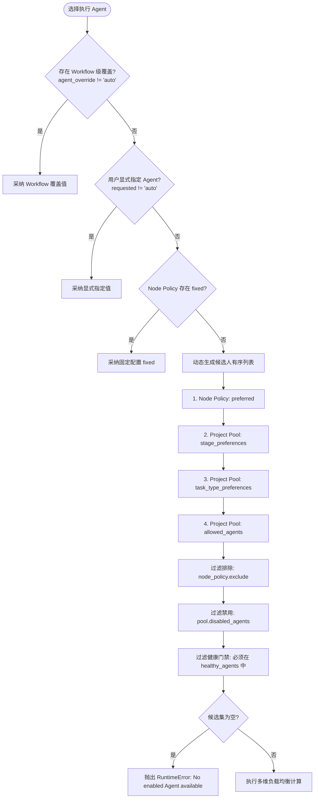

# 异构 Agent 路由策略与并发锁 (agent-routing-and-pools.md)

> **多 Agent 调度、优先级评分、负载均衡与 Reservation 预占锁**  
> 关联索引: [[index]] | [[domain-model]] | [[preflight-and-health]] | [[task-lifecycle]]

---

## 1. 路由优先级与选人决策树

在任务派发（`choose_agent`）时，系统按以下严格优先级梯次裁决执行 Agent：

Evidence:
- `herdr/agent_router.py#_candidate_order`
- `herdr/agent_router.py#choose_agent`
- `tests/test_workflow_engine.py#test_candidate_order_with_preferred`

---

## 2. 负载均衡与最少活跃优先 (Least Loaded)

当产生多个合规候选 Agent 时，系统通过最小负载评分进行排序：
- `FACT` **活跃任务负载 (`active_loads`)**: 统计 `tasks.json` 中属于该项目且状态为未终结（`pending` 到 `cleanup_ready` 之间）的各 Agent 任务总数。
- `FACT` **锁预占负载 (`reserved_loads`)**: 统计 `agent-reservations.json` 中当前被预占但尚未落盘到 `tasks.json` 的各 Agent 数量。
- `FACT` **综合评分**:
  $$\text{Score}(Agent) = \text{ActiveTasks}(Agent) + \text{ReservedTasks}(Agent)$$
  具有最低综合得分的候选 Agent 将被优先选中；当得分相同时，维持候选顺序中靠前的 Agent。

Evidence:
- `herdr/agent_router.py#_active_agent_loads`
- `herdr/agent_router.py#choose_agent` (排序键: `active_loads + reserved_loads, item[0]`)

---

## 3. 并发死锁防御：Reservation 预占锁与 TTL

### 3.1 预占锁解决的核心冲突
在并发派发多个并行任务时，如果从“选定 Agent”到“写入 `tasks.json`”之间存在微秒级延迟，可能导致多个并行任务重复选中同一个空闲 Agent，瞬间造成单点过载。

### 3.2 锁与交接机制
`FACT` Herdr 引入了排他预占锁：
1. **获取排他锁**: 选人逻辑在 `fcntl.flock(lock.fileno(), fcntl.LOCK_EX)` 保护下执行。
2. **写预占记录**: 选中 Agent 后，立即在 `agent-reservations.json` 写入带时间戳的 Reservation。
3. **300 秒 TTL 自愈**:
   - `_clean_reservations` 每次遍历时，检查 Reservation 的 `created_at`。
   - 若某任务超过 300 秒仍未写入 `tasks.json`（例如 worker 进程中途崩溃），该预占锁强制自动释放，防止全局死锁。
4. **所有权平滑交接**:
   - 一旦 Task 成功注册到 `tasks.json`，清理函数检测到 `task_id in registered`，立刻将其从 reservations 中移除，无缝交接给 `tasks.json` 维持活跃计数。

Evidence:
- `herdr/agent_router.py#_clean_reservations`
- `herdr/agent_router.py#release_agent_reservation`
- `RULES.md:并发与死锁防御`

---

## 4. 门禁防御：Deep Preflight 强制健康检查

> [!WARNING]
> **No READY Agent 路由阻断机制**  
> 如果工作流实例记录了 `healthy_agents`，选人系统将强制拒绝任何未出现在健康列表中的 Agent。若所有 Agent 均因 Token 耗尽或登录失效而未通过体检，路由将主动阻断抛错，防止向不可用环境盲目派发任务造成状态卡死。

Evidence:
- `herdr/agent_router.py#choose_agent`
- `CLAUDE.md:坑点 4：No READY Agent found 路由阻断`
- [[preflight-and-health]]
