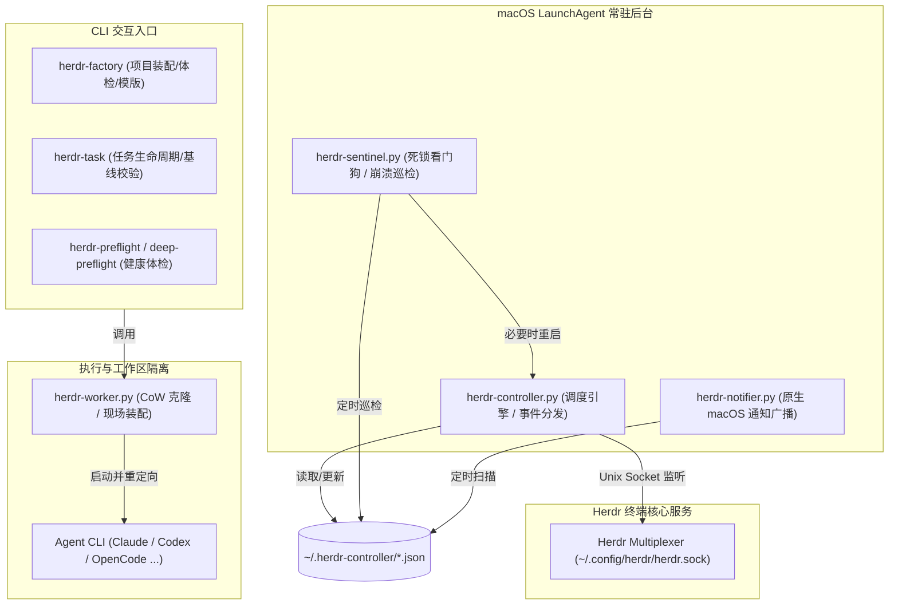

# 运行架构与进程拓扑 (architecture.md)

> **进程体系、通信机制与后台守护**  
> 关联索引: [[index]] | [[system-overview]] | [[task-lifecycle]] | [[tab-node-model]]

---

## 1. 进程拓扑与角色分层

Herdr 系统的运行时由三种生命周期的进程构成：**CLI 工具链**、**常驻 LaunchAgent 守护进程**与**瞬时 Worker 任务进程**。

Evidence:
- `services/herdr-controller.py`
- `services/herdr-sentinel.py`
- `services/herdr-notifier.py`
- `services/herdr-worker.py`
- `CLAUDE.md:常用开发与运维命令`

---

## 2. 后台常驻守护进程详解

### 2.1 Herdr Controller (`services/herdr-controller.py`)
- `FACT` **核心职能**:
  1. **状态流转监听**: 维护与 Herdr Unix Domain Socket (`~/.config/herdr/herdr.sock`) 的持久连接，接收各 Pane 的实时 Agent 状态（如 `agent_done`, `error`）。
  2. **DAG 依赖推进**: 周期性扫描 `tasks.json`。当某节点的所有 Task 完成（状态到达 `cleaned` 或 `completed`）时，计算后续就绪节点（[[dag-workflow-engine]]）。
  3. **协调器注入**: 向项目总指挥 Pane (`coordinator_pane_id`) 输入结构化文本提示，指导总指挥 Agent 发起下一阶段 Task 派发。
  4. **重复防抖**: 利用 `stage-state.json` 记录 `queued` / `notified`，杜绝重复向总指挥发送推进指令。
- `FACT` **终态闸门（2026-09-13 幽灵推进事故后引入）**: 推进扫描只遍历注册表**非终态**条目（`herdr.projects.non_terminal_workflow_ids`，`status=="completed"` 视为终态）；`check_workflow_stage_advance` 对已关闭工作流早退；stage_advance 消费线程在**每次等待迭代**重新校验终态/注销，已入队事件在工作流关闭后被丢弃（`[STAGE ADVANCE DROP]`）。背景：零任务工作流对 `is_node_complete` 真空成立，无此闸门会被逐阶段"真空推进"并向共享协调者 Pane 注入幽灵提示，诱导其派发真实任务（wf-…-111426 事故，见 lessons §12）。
- `FACT` **创建闸门（herdr-factory 侧）**: `herdr-factory run` 在注册前持 per-project flock（`~/.herdr-controller/locks/<project_id>.workflow-create.lock`）原子执行「同项目活跃工作流检查 + 注册」；同项目已有非终态工作流时拒绝创建（exit 2，列出活跃工作流与处置指引），`--force` 显式 bypass（e2e 自动 bypass）。同项目工作流共享协调者 Pane 与阶段拓扑，默认必须串行。

### 2.2 Herdr Sentinel (`services/herdr-sentinel.py`)
- `FACT` **核心职能**:
  1. **崩溃模式拦截**: 每 3 秒巡检处于 `ACTIVE` 状态（`dispatched`, `working`, `blocked`, `rework`）的任务。
  2. **终端可见内容探测**: 通过 `herdr pane read <pane_id> --source visible` 捕获终端异常特征。
  3. **特征匹配**: 匹配 `"Bun has crashed"`, `"segmentation fault"`, `"panic(main thread)"` 等底层崩溃，并在 `tasks.json` 中标记 `sentinel_reason`，更新任务状态。
  4. **假死自动破冰 (Nudge Enter)**: 针对因按键卡顿处于假死状态的窗格，在超过 15 秒无响应时自动向 Pane 发送 `enter` 触发恢复。
  5. **自愈救援**: 发现 Controller 进程僵死时，主动执行 `launchctl kickstart -k` 重启 Controller。

### 2.3 Herdr Notifier (`services/herdr-notifier.py`)
- `FACT` **核心职能**:
  1. 异步轮询 `tasks.json`。
  2. 触发条件：当任务进入关注状态（`blocked`, `failed`, `human_review`, `needs_action`）或整个 Workflow 全部完成时。
  3. 通过 macOS 原生系统通知派发：优先使用 `terminal-notifier` 附带 `-open` 直达控制台 Deep-Link URL（`http://127.0.0.1:8765/?workflow_id=...&task_id=...`），未安装时安全降级为 `osascript`。

Evidence:
- `services/herdr-controller.py#main`
- `services/herdr-sentinel.py:CRASH_PATTERNS`
- `services/herdr-sentinel.py#nudge_enter`
- `services/herdr-notifier.py#notify`

---

## 3. 进程间通信与持久化契约

### 3.1 共享状态目录 (`~/.herdr-controller/`)
所有组件通过本地标准 JSON 文件通信与同步状态：

| 文件名 | 职责与归属 | 核心结构 |
| :--- | :--- | :--- |
| `tasks.json` | 全局工单状态机，所有组件的核心数据流 | `{"tasks": [Task, ...]}` |
| `projects.json` | 本地 Git 仓库到 Herdr Workspace/Coordinator 的映射中心 | `{"projects": {<root>: Project}}` |
| `workflows.json` | 运行中的工作流实例元数据 | `{"workflows": {<wf_id>: Workflow}}` |
| `stage-state.json` | Controller 内部阶段推进防抖状态 | `{<wf_id>:<stage>: "queued"\|"notified"}` |
| `agent-pools.json` | 各项目 Agent 白名单与偏好矩阵 | `{"projects": {<proj_id>: Pool}}` |
| `agent-reservations.json` | 动态预占锁中心（带 300s TTL） | `{"reservations": {<task_id>: Reservation}}` |
| `agent-router.lock` | 文件排他锁，保证并发分人安全 | `fcntl.flock` 目标文件 |

### 3.2 并发与原子写入保障
`FACT` 为防止多进程并发读写导致 JSON 损坏，代码中严格执行两种保护：
1. **原子替换**: 写入时先写 `<file>.tmp`，调用 `os.replace` 进行原子重命名。
2. **文件锁排他**: 对关键资源（如 `agent-reservations.json`）在读写前通过 `fcntl.flock(lock.fileno(), fcntl.LOCK_EX)` 获得独占锁。

Evidence:
- `herdr/agent_router.py#release_agent_reservation`
- `herdr/projects.py#_save`
- `services/herdr-sentinel.py#save_json_atomic`

---

## 4. 关键运维约束：LaunchAgent 进程生命周期

> [!CAUTION]
> **LaunchAgent 代码热更新陷阱**  
> 修改了 `services/herdr-controller.py` 或 `herdr/` 中的代码后，正在运行的后台 LaunchAgent **不会**自动热重载新代码，内存中仍旧跑着旧字节码！  
> **必须执行**: `launchctl kickstart -k gui/$(id -u)/com.user.herdr-controller`  
> **严禁操作**: 在终端直接执行 `python3 services/herdr-controller.py`（会导致多个 Controller 抢占同一个 Unix Socket 和状态文件）。

Evidence:
- `RULES.md:守护进程运维红线`
- `CLAUDE.md:坑点 1：LaunchAgent 进程更新陷阱`
