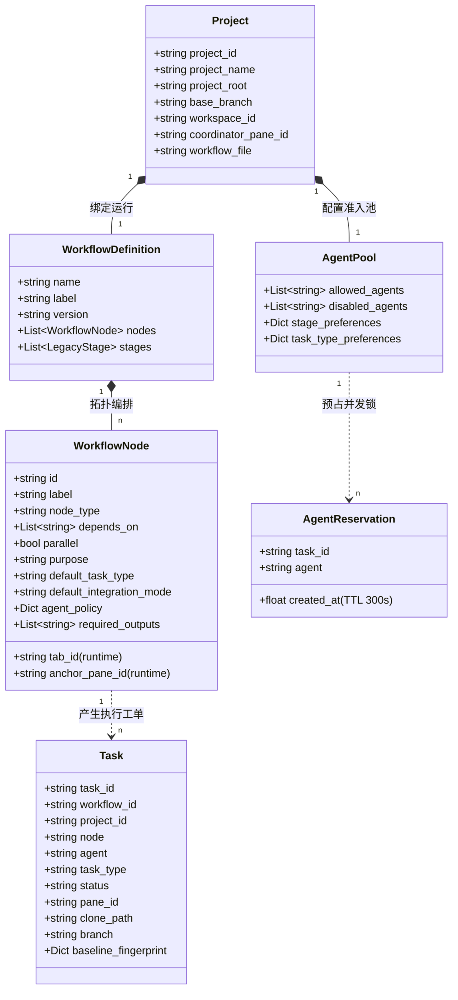

# 领域模型与核心实体 (domain-model.md)

> **实体定义、对象关系与持久化契约**  
> 关联索引: [[index]] | [[system-overview]] | [[tab-node-model]] | [[task-lifecycle]]

---

## 1. 领域对象全景模型

Herdr 的核心业务概念由**项目绑定**、**工作流定义**、**空间现场**与**任务工单**四大聚合构成。

Evidence:
- `herdr/projects.py:provision_project`
- `herdr/workflow.py:normalize_workflow`
- `bin/herdr-task:TRANSITIONS`
- `herdr/agent_router.py:ensure_pool_for_project`

---

## 2. 核心实体详细说明

### 2.1 Project (项目空间)
- `FACT` **定义**: 对应本地一个真实的 Git 仓库根目录。
- `FACT` **生成规则**:
  - `project_id`: 由目录名 Slug 加上仓库绝对路径的 SHA1 前 8 位组合生成，确保单机唯一（如 `nexusarchive-a1b2c3d4`）。
  - `workspace_id`: 在 Herdr 终端中专属创建的 Workspace ID（如 `w9`）。
  - `coordinator_pane_id`: 专属于该项目的总指挥交互窗格（如 `w9:p1`）。
  - `base_branch`: 自动嗅探或指定的基线开发分支（`main` / `dev` / `master`）。

Evidence:
- `herdr/projects.py#project_id_for`
- `herdr/projects.py#detect_base_branch`

### 2.2 Workflow Definition & Node (工作流定义与拓扑节点)
- `FACT` **定义**: 描述项目研发或业务生产流程的声明式 DAG。
- `FACT` **关键属性**:
  - `nodes`: 拓扑节点列表。每个节点具有全局唯一的 `id`、展示名 `label` 及前置依赖列表 `depends_on`。
  - `agent_policy`: 节点级 Agent 派发策略，可定义 `fixed`（固定指定）、`preferred`（优先列表）、`exclude`（排除列表）、`parallel`（最大并发数）。
  - `runtime mappings`: 包含 `tab_id` 与 `anchor_pane_id`。这两者**不是**节点的静态属性，而是动态写入的易失运行时映射。
- `FACT` **双向兼容机制 (`normalize_workflow`)**:
  - 系统历史上曾使用线性 `stages`。现在的引擎在加载任何模板或配置时，透明在 `nodes` 与 `stages` 之间执行双向同步补齐。

Evidence:
- `herdr/workflow.py#normalize_workflow`
- `docs/product-specs/agent-policy-spec.md`

### 2.3 Task (任务工单)
- `FACT` **定义**: 针对具体某个 Node 派发的一次独立 Agent 执行单元。
- `FACT` **核心字段**:
  - `task_id`: 工单唯一标识（如 `TASK-001`）。
  - `status`: 任务当前在 11 状态机中所处的状态（[[task-lifecycle]]）。
  - `pane_id`: 运行该 Task 的 Herdr 终端窗格。
  - `clone_path`: 该 Task 独占的 CoW Git 克隆物理目录（`~/.herdr-controller/clones/<task_id>`）。
  - `branch`: 独占 Git 分支名（格式为 `agent/{agent}/{task_type}-{task_id}`）。
  - `baseline_fingerprint`: 派发瞬间针对工作区未提交脏文件和未跟踪文件采样的 SHA1 树快照。

Evidence:
- `bin/herdr-task:TRANSITIONS`
- `services/herdr-worker.py#create_task_branch`
- `services/herdr-worker.py#build_baseline_fingerprint`

### 2.4 Agent Pool & Reservation (Agent 准入池与预占锁)
- `FACT` **AgentPool**: 存储在 `agent-pools.json` 中，按 `project_id` 隔离。决定某个项目允许使用哪些 Agent、禁用哪些 Agent，以及不同节点与任务类型的选人偏好。
- `FACT` **AgentReservation**: 存储在 `agent-reservations.json` 中。
  - 当通过 `herdr-task launch` 或 `choose_agent` 决定分配 Agent 时，会在锁文件中预占一个 Reservation 记录。
  - `TTL`: 预占锁具备 300 秒强制超时回收机制。
  - `交接规则`: 一旦 Task 被正规注册写入 `tasks.json`，该 Task 将从 reservations 中清理，转由 `tasks.json` 中的实际 `status` 接管全局负载计数。

Evidence:
- `herdr/agent_router.py#_clean_reservations`
- `herdr/agent_router.py#choose_agent`

---

## 3. 核心领域不变量 (Invariants)

1. `FACT` **Anchor Pane 永不执行业务**: 每个 Node Tab 内命名为 `"Anchor"` 的窗格专供 `herdr pane split` 分裂新工位使用，绝对不能被分配给 Task 作为工作窗格。
2. `FACT` **一个 Task 一个隔离克隆**: 一个 Task 永远对应一个独立的 CoW 克隆目录，绝不允许两个并发 Task 共享同一个克隆目录。
3. `FACT` **DAG 拓扑无环**: 工作流节点的 `depends_on` 依赖图谱必须严格为有向无环图（DAG），在模板加载与运行时校验阶段由 Kahn 算法强制保障。

Evidence:
- `herdr/pane_pool.py#list_slots_for_project` (过滤 anchors)
- `herdr/workflow.py#validate_workflow_dag`
