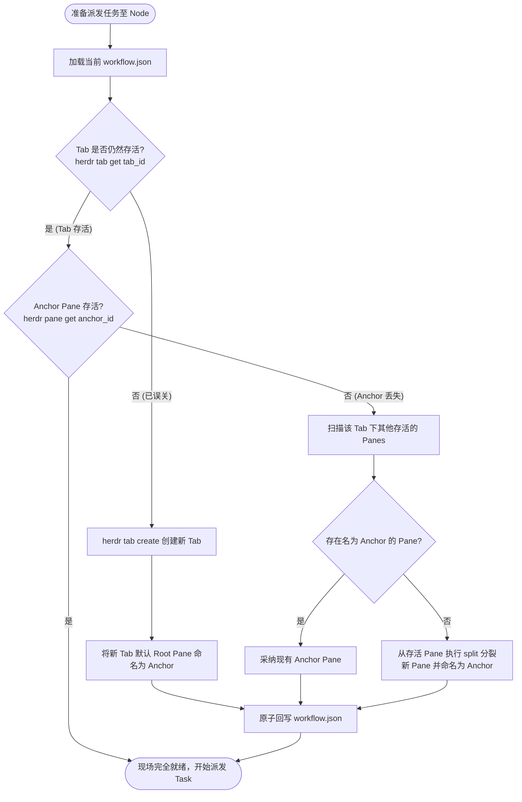

# 空间现场模型与动态自愈机制 (tab-node-model.md)

> **公司：上海共事智能科技有限公司**  
> **品牌：共事**  
> **产品：HAFlow**  
> **一句话：让人和多个 AI Agent 一起把事情做完**  
> *Human + Agent, in Flow*  
> **Tab = Node 空间现场、Anchor 母体机制与任务派发前拓扑自动自愈**  
> 关联索引: [[index]] | [[system-overview]] | [[domain-model]] | [[task-lifecycle]]

---

## 1. 核心设计哲学：Tab = Workflow Node

在早期的硬编码设计中，系统将步骤固化为 `requirements` ➔ `plan` ➔ `implementation` 等固定 6 个阶段，导致无法编排非研发类流程，且一旦用户误关终端窗格，整个调度直接崩溃。

现代 HAFlow 确立了根本性解耦原则：
> `FACT` **Workflow 拓扑定义是逻辑事实；终端的 Tab ID 与 Pane ID 仅仅是易失的运行时现场缓存。**

```text
Workspace (项目全局空间，如 w9)
  │
  ├── Tab 1: Coordinator (总指挥大脑)
  │     └── Pane 1: 总指挥 Agent (交互式总指挥，接收 Controller 指令)
  │
  ├── Tab 2: Node 1 (工作流节点现场，如 2需求分析)
  │     ├── Pane 0 (Anchor): 母体锚点 (保持 Tab 存活，只读，专供分裂新工位)
  │     ├── Pane 1: Task A (Agent 1 现场)
  │     └── Pane 2: Task B (Agent 2 并发工位)
  │
  └── Tab N: Node N (其他工作流节点现场)
        ├── Pane 0 (Anchor): 母体锚点
        └── Pane Task-X: 业务工位
```

Evidence:
- `docs/architecture/tab-node-model.md`
- `herdr/projects.py#ensure_node_runtime`
- `scripts/herdr-topology-selfheal-install.sh`

---

## 2. Anchor Pane (母体锚点) 机制

### 2.1 为什么必须有 Anchor Pane？
`FACT` 底层 Herdr 终端在已有标签页中新建工位时，依赖指令：
```bash
herdr pane split <parent_pane_id> --direction right ...
```
这意味着：**在 Tab 内新增窗格必须指定一个存活的父 Pane。**  
如果一个 Tab 中的所有任务工位在执行完毕后均被用户关闭，且该 Tab 内没有常驻底座，该 Tab 将彻底失去通过常规 `split` 分裂新工位的能力。

因此，Herdr 为每个 Node Tab 建立一个专门的 **Anchor Pane**：
1. **命名固定**: 窗格 Label 固定命名为 `"Anchor"`（或 `Herdr Anchor · <node_id>`）。
2. **绝对干净**: 严禁在 Anchor Pane 上启动任何 Agent 或执行耗时任务，使其保持只读。
3. **母体作用**: 当为该 Node 派发新的 Task 时，系统统一以 Anchor Pane 为 parent 执行 `pane split` 分裂新工位。

Evidence:
- `herdr/projects.py:provision_project`
- `herdr/pane_pool.py#list_slots_for_project` (显式跳过 anchor_pane_id)
- `services/herdr-worker.py#create_pane`

---

## 3. 动态自愈引擎 (`ensure_node_runtime`)

`FACT` 在每次任务派发（`herdr-task launch` 或 `bin/herdr-task:resolve_node`）前，系统**强制**执行拓扑自愈检查。



### 关键自愈规则：
1. `FACT` **工作区不灭原则**: 缺失 Anchor 或 Tab 仅属于可自愈的局部现场故障，**绝对不会**触发重新 provision 整个项目 Workspace。
2. `FACT` **历史工位隔离原则**: 正在跑历史任务或带有 Agent 进程的 Pane 绝对不会被挪用为 Anchor，确保历史工位现场可审计。
3. `FACT` **自动回写**: 一旦检测到 Tab 或 Anchor ID 发生变化，系统立即通过原子写入更新 `<project_dir>/workflow.json`。

Evidence:
- `herdr/projects.py#ensure_node_runtime`
- `herdr/topology.py#ensure_stage_topology`
- `RULES.md:拓扑动态自愈红线`
- `CLAUDE.md:坑点 3：Tab 与 Anchor Pane 误关与易失性`
