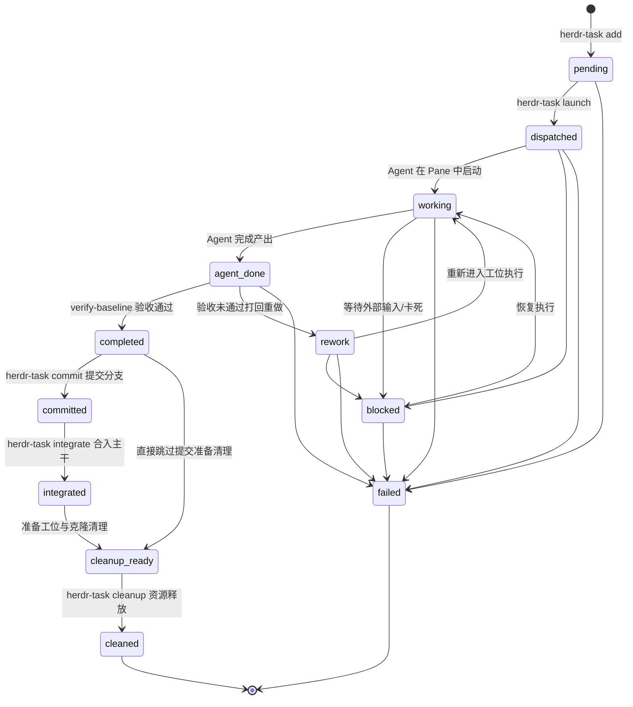

# 任务生命周期与基线验收机制 (task-lifecycle.md)

> **任务 11 状态机、CoW 克隆隔离与基线快照验收**  
> 关联索引: [[index]] | [[system-overview]] | [[domain-model]] | [[dag-workflow-engine]]

---

## 1. 任务状态机 (Task State Machine)

`FACT` Herdr 任务生命周期严格由 11 个离散状态及其状态转换矩阵（`TRANSITIONS`）定义，任何越权状态变更将被 CLI 直接拦截。

Evidence:
- `bin/herdr-task:TRANSITIONS`
- `bin/herdr-task#set_status`

---

## 2. CoW (Copy-on-Write) 沙盒隔离机制

`FACT` 任何研发修改类任务绝不在项目主干目录执行，而必须在独立克隆中运行：
- **物理路径**: `~/.herdr-controller/clones/<task-id>`
- **秒级克隆实现**: 在 macOS APFS 文件系统上，调用底层 `cp -cR <source_project> <clone_path>` 实现毫秒级、零初始磁盘占用的 Copy-on-Write 克隆。
- **分支规范**: 在克隆目录中切换至任务专属分支：  
  `agent/{agent}/{task_type}-{slug_task_id}`（如 `agent/codex/feat-task-001`）。

Evidence:
- `services/herdr-worker.py#create_clone`
- `services/herdr-worker.py#create_task_branch`
- `RULES.md:空间隔离红线`

---

## 3. 基线指纹快照 (Baseline Fingerprint) 核心机制

### 3.1 为什么普通 `git status` 在沙盒中会产生严重误判？
> [!IMPORTANT]
> **代码中的核心隐性知识**  
> 当开发者或主干工作区在派发任务前存在尚未提交的改动或未跟踪文件时，`cp -cR` 会将这些主干未提交文件**一并完整克隆到沙盒中**！  
> 如果在沙盒中仅仅执行普通的 `git status`，所有主干原有的未提交文件都会被列出，导致验收工具或 Agent 误以为这些文件都是当前 Task 的修改产出。

### 3.2 基线指纹解决方案
`FACT` Herdr 通过任务启动瞬间的指纹采样来解决此问题：
1. **采样阶段 (`build_baseline_fingerprint`)**:
   - 任务派发瞬间，Worker 扫描克隆目录中已跟踪的脏文件（`git diff --name-only -z HEAD`）和未跟踪文件（`git ls-files --others`）。
   - 对每个文件内容计算 SHA1 校验和，形成快照并记录入 `tasks.json` 的 `baseline_fingerprint` 字段。
   - 特殊规则：内部控制文件 `.agent-task-context` 自动从指纹中过滤。
2. **验收阶段 (`verify-baseline`)**:
   - 运行 `./bin/herdr-task verify-baseline <task-id>`。
   - 系统将当前克隆文件状态与 `baseline_fingerprint` 进行逐项对比。
   - 只有真正由 Agent 在任务期间修改或新增的文件，才会归入 `TASK_CHANGED` 列表。
   - 若未发生任何实质改动，报告 `BASELINE_MATCH`，拒绝盲目合并。

Evidence:
- `services/herdr-worker.py#build_baseline_fingerprint`
- `bin/herdr-task#cmd_verify_baseline`
- `CLAUDE.md:坑点 2：CoW Clone 变化识别与验收假象`

---

## 4. E2E 自动化测试验收的特殊规则

`FACT` 在针对工作流进行 E2E 自动化测试时（如 `workflow_id` 以 `e2e-` 开头）：
- 终端 CLI 在 alternate-screen（备用屏幕缓冲）模式下运行，可能导致 `herdr pane read` 读到的终端可见内容暂时为空白。
- 验收准则：**严禁依赖终端是否能读取到固定文本**。
- 只要 Herdr 任务生命周期到达 `agent_done`，且 `verify-baseline` 返回变更合规，即判定任务成功，直接流转为 `completed`，禁止因屏幕空白打回 `rework`。

Evidence:
- `workflow_templates/software-development-v1.yaml:rules`
- `workflow_templates/bidding.yaml:rules`

---

## 5. 物理收尾与证据固化 (Physical Teardown)

`FACT` 任务遵循"生而隔离,死而清零"生命周期:出生时独立 pane + CoW clone +
全新 agent 会话;验收收敛后由 `finalize` / `close-workflow` 执行物理销毁。
上下文只在任务体内生存,跨任务唯一合法信息通道是固化产物(git commits /
integration branch / 转写证据 / 任务记录)。pane 从不复用——
`_claimed_panes` 的永久占用是该原则的执行机制,而非缺陷。

### 5.1 finalize 序列(幂等)

1. **闸门**:仅允许非活跃状态;`failed` 需 `--force`。
2. **证据先行**:herdr 不持久化终端 scrollback,销毁 pane 前必须
   `pane read --source recent-unwrapped` dump 到
   `~/.herdr-controller/logs/tasks/<task_id>/terminal.log`(+ `meta.json` 含 agent_session)。
3. `pane close`;4. clone 处理;5. 状态沿 `completed→cleanup_ready→cleaned` 推进。

### 5.2 clone 删除安全档位

- 有 `integration_ref/branch`(已完成 integrate)或 `superseded` → 可删;
- `committed` 未 integrate → 拒删(commit 仅存于 clone);
- mode=none 的 docs/test/review 任务无 integration 通道 → 默认保留,
  `--purge-clones` 显式授权后才删。

### 5.3 close-workflow 与共享 tab 守卫

`herdr-task close-workflow <wf>`:活跃任务闸门 → 逐任务 finalize → 关阶段 tab →
标记 workflows.json `completed` → 清 stage-state → 输出收尾报告。
- **共享 tab 连带销毁守卫**:连续 workflow 常复用同一 workspace 的阶段 tab,
  关 tab 前必须校验 tab 内全部存活 pane 均属本 workflow(锚点 + 本 workflow 任务);
  有外来 pane 或 pane list 不可用时跳过该 tab 并写入报告 `tabs_skipped`。
- **总指挥 pane 例外**:默认保留至知识沉淀 + PR 合并后由
  `--include-coordinator` 关闭。
- **自动触发**:Controller 在 `is_workflow_completed` 时后台调用
  `close-workflow`(in-flight 防重入 + status=completed 短路);
  零任务的已登记运行视为平凡完成。

Evidence:
- `bin/herdr-task#finalize_task` `#close_workflow` `#_tab_foreign_panes` `#dump_transcript`
- `services/herdr-controller.py#maybe_close_completed_workflow`
- `docs/walkthroughs/20260913-workflow-finalize.md`
